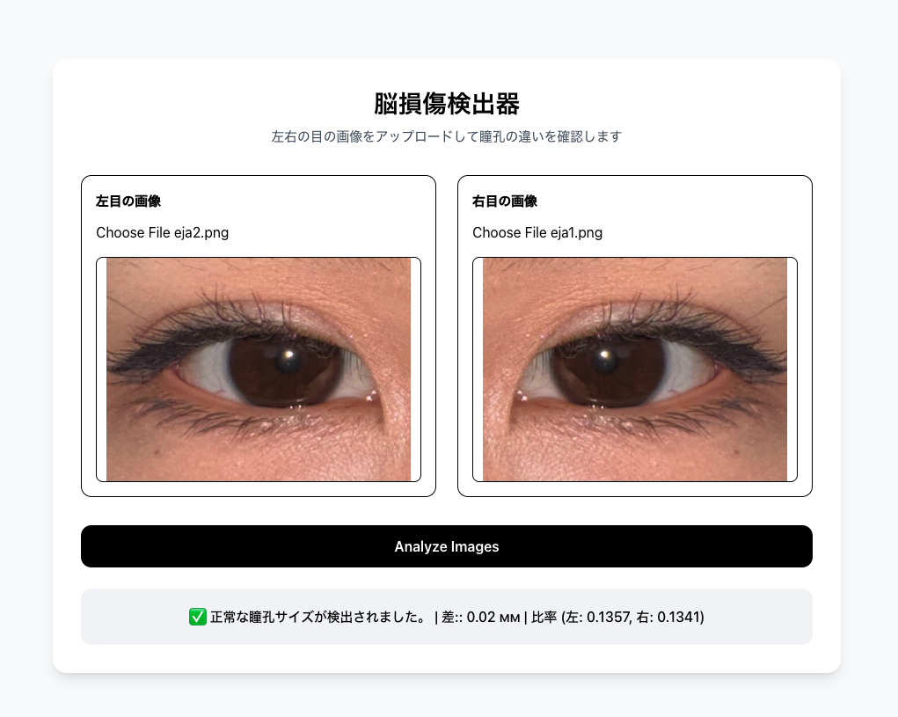

# PupilSense — AIを用いた脳損傷検知システム

Frontend Demo:
https://project-pupil.vercel.app/

Backend API:
https://project-pupil.onrender.com/

GitHub Repository:
https://github.com/saruuldesu/project_pupil

---

## Demo Result

### 結果例



---

# テスト方法
https://project-pupil.vercel.app/

以下のサンプル画像を利用してテスト可能です。

project_pupil/test

左目画像・右目画像をアップロードすると、瞳孔左右差解析結果が表示されます。

---
# 概要

PupilSenseは、瞳孔の左右差を解析することで、外傷性脳損傷（TBI）などの神経学的異常の可能性を検知することを目的とした、AIベースの医療画像解析Webアプリケーションです。

本プロジェクトでは以下を組み合わせています。

* 深層学習を用いたコンピュータビジョン
* フルスタックWeb開発
* AIモデル推論
* REST API連携
* クラウドデプロイ

ユーザーが左右の眼画像をアップロードすると、バックエンド側で瞳孔径を解析し、左右差を推定します。

---

# 技術スタック

## Frontend

* Next.js
* React
* TypeScript
* Tailwind CSS
* Vercel

## Backend

* FastAPI
* Python
* OpenCV
* PyTorch
* Detectron2

## AI / Computer Vision

* オープンソースのPupilSenseモデルをFine-tuning
* Detectron2による瞳孔セグメンテーション
* 画像前処理および瞳孔径解析

## Deployment

* Vercel（Frontend）
* Render + Docker（Backend）

---

# 開発内容

本プロジェクトでは、オープンソースの瞳孔検出モデルをベースに、脳損傷検知用途向けにカスタマイズおよびFine-tuningを行いました。

バックエンドでは以下を使用しています。

* PyTorch
* Detectron2
* OpenCV

モデルは眼画像から瞳孔領域を検出し、左右の瞳孔径差を算出します。

処理フローは以下の通りです。

1. ユーザーが左右の眼画像をアップロード
2. FastAPIバックエンドへ送信
3. Detectron2による瞳孔セグメンテーション
4. 瞳孔輪郭を抽出
5. 左右の瞳孔径比率を計算
6. 瞳孔左右差を解析
7. 結果をFrontendへ返却

左右の瞳孔径差（Anisocoria）は、脳損傷や神経学的異常と関連する場合があります。

---

# 主な機能

* AIによる瞳孔セグメンテーション
* 眼画像アップロードUI
* リアルタイム推論
* REST API連携
* Docker化されたMLバックエンド
* フルスタック構成
* クラウドデプロイ

---

# Live Demo

Frontend:
https://project-pupil.vercel.app/

Backend:
https://project-pupil.onrender.com/

---

# ローカル実行方法

## Frontend

```bash
cd brain-injury-detector
npm install
npm run dev
```

起動後:

```bash
http://localhost:3000
```

---

## Backend

```bash
cd PupilSense
pip install -r requirements.txt
cd /Users/saruul/Desktop/project_pupil/PupilSense/detectron2

export SDKROOT=$(xcrun --sdk macosx --show-sdk-path)
export CPLUS_INCLUDE_PATH="$SDKROOT/usr/include/c++/v1"

MAX_JOBS=1 \
CC=clang \
CXX=clang++ \
FORCE_CUDA=0 \
SDKROOT=$SDKROOT \
CPLUS_INCLUDE_PATH=$CPLUS_INCLUDE_PATH \
python -m pip install -e . --no-build-isolation --no-cache-dir
uvicorn main:app --reload
```

起動後:

```bash
http://localhost:8000
```

---

# 技術的課題・工夫した点

* データ前処理・モデル学習・推論・Webアプリ統合・クラウドデプロイまで一貫して実装
* Frontendからアップロードされた画像に対するリアルタイム推論処理実装
* FastAPIバックエンドへのモデル統合
* Fine-tunedモデルを利用した瞳孔左右差検出機能実装
* オープンソースPupilSenseモデルのFine-tuning
* Detectron2学習用フォーマットへのデータ変換
* オープンソースの瞳孔画像データセットに対するマスキング・アノテーション作業
* 推論処理最適化
* Renderデプロイ対応
* Frontend / Backend統合
* 大容量モデルファイル管理
* PyTorch依存関係の調整
* DockerによるAI推論環境構築
* Detectron2環境構築

---

# 注意事項

本プロジェクトは研究・学習目的のプロトタイプです。

医療診断用途を目的としたものではなく、専門的な医療判断の代替には使用できません。
